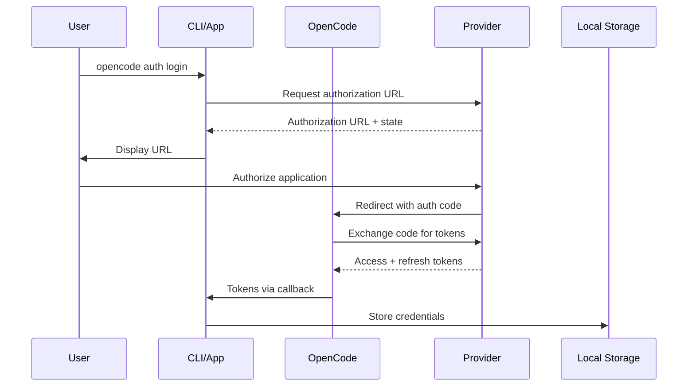
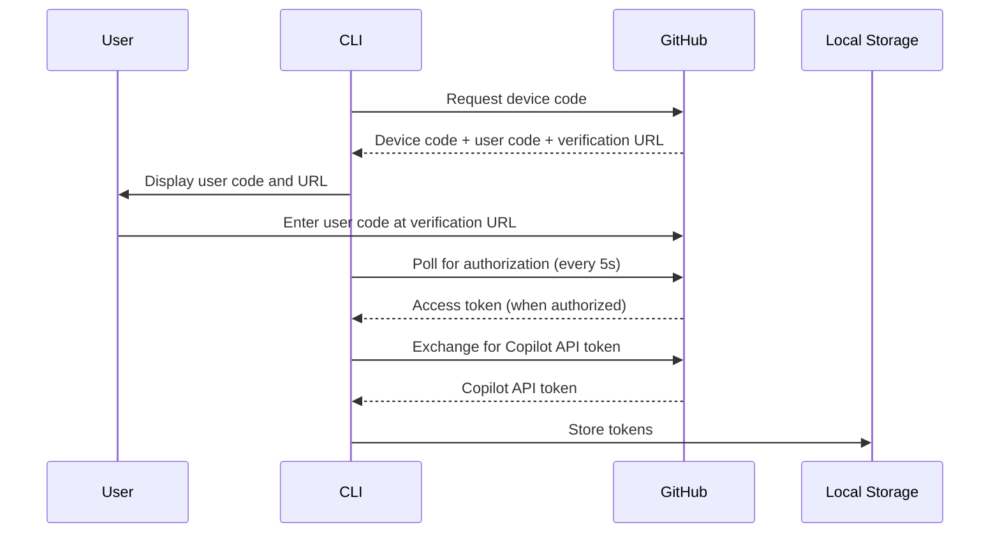

# OpenCode Authentication System Documentation

## Executive Summary

The OpenCode authentication system is a comprehensive, multi-layered authentication framework that supports OAuth 2.0, API keys, and well-known provider integrations. Built with TypeScript and modern web standards, it serves both CLI and cloud applications with secure credential management, session handling, and provider-specific authentication flows.

**Key Features:**
- Multi-provider authentication support (OpenCode, Anthropic, GitHub Copilot, OpenAI, Google, etc.)
- OAuth 2.0 device flow implementation
- API key-based authentication
- Well-known provider auto-discovery
- Secure credential storage with file permissions (0o600)
- Session management with httpOnly cookies
- Plugin-based extensibility for new providers

## Architecture Overview

### Core Components

```
┌─────────────────────────────────────────────────────────────┐
│                    OpenCode Authentication                   │
├─────────────────────────────────────────────────────────────┤
│  CLI Authentication          │  Cloud Authentication        │
│  ├─ Local Credential Store   │  ├─ OpenAuth Integration     │
│  ├─ Provider Detection       │  ├─ Session Management       │
│  ├─ OAuth Device Flow        │  ├─ Actor System             │
│  └─ Environment Variables    │  └─ Database Persistence     │
├─────────────────────────────────────────────────────────────┤
│                    Shared Components                         │
│  ├─ Auth Types & Schemas     │  ├─ Plugin System            │
│  ├─ Provider Registry        │  ├─ Token Management         │
│  └─ Security Utils           │  └─ Error Handling           │
└─────────────────────────────────────────────────────────────┘
```

### File Structure

```
packages/opencode/src/auth/
├── index.ts                 # Core auth types and storage
├── github-copilot.ts       # GitHub Copilot OAuth implementation
└── ...

packages/opencode/src/cli/cmd/
└── auth.ts                 # CLI authentication commands

cloud/app/src/
├── routes/auth/
│   ├── authorize.ts        # OAuth authorization endpoint
│   ├── callback.ts         # OAuth callback handler
│   └── index.ts           # Auth route dispatcher
└── context/
    ├── auth.ts            # Auth client and actor management
    ├── auth.session.ts    # Session management
    └── auth.withActor.ts  # Actor middleware

cloud/core/src/schema/
├── account.sql.ts         # Account table schema
├── user.sql.ts           # User table schema
└── key.sql.ts            # API key table schema

packages/plugin/src/
└── index.ts              # Plugin auth hooks and types
```

## Authentication Types

### 1. OAuth Authentication

```typescript
export const Oauth = z.object({
  type: z.literal("oauth"),
  refresh: z.string(),    // Refresh token
  access: z.string(),     // Access token
  expires: z.number(),    // Expiration timestamp
})
```

**Supported OAuth Flows:**
- Authorization Code with PKCE
- Device Flow (GitHub Copilot)
- Automatic authorization detection

### 2. API Key Authentication

```typescript
export const Api = z.object({
  type: z.literal("api"),
  key: z.string(),        // API key
})
```

**Usage:** Direct API key storage for providers like OpenAI, Anthropic, etc.

### 3. Well-Known Provider Authentication

```typescript
export const WellKnown = z.object({
  type: z.literal("wellknown"),
  key: z.string(),        // Environment variable name
  token: z.string(),      // Token value
})
```

**Usage:** Auto-discovery of provider authentication through `/.well-known/opencode` endpoints.

## OAuth Flow Documentation

### Standard OAuth 2.0 Flow



### GitHub Copilot Device Flow



**Implementation Details:**

```typescript
// From packages/opencode/src/auth/github-copilot.ts
const CLIENT_ID = "Iv1.b507a08c87ecfe98"
const DEVICE_CODE_URL = "https://github.com/login/device/code"
const ACCESS_TOKEN_URL = "https://github.com/login/oauth/access_token"
const COPILOT_API_KEY_URL = "https://api.github.com/copilot_internal/v2/token"
```

## Claude Max Integration

### Authentication Flow

Claude Max uses the cloud authentication system with OpenAuth integration:

```typescript
// From cloud/app/src/context/auth.ts
export const AuthClient = createClient({
  clientID: "app",
  issuer: import.meta.env.VITE_AUTH_URL,
})
```

### Actor System

The cloud platform implements an actor-based authorization system:

```typescript
interface Actor.Info {
  type: "account" | "user" | "public"
  properties: {
    email?: string
    accountID?: string
    userID?: string
    workspaceID?: string
  }
}
```

### Session Management

Sessions are managed with Vinxi and httpOnly cookies:

```typescript
// From cloud/app/src/context/auth.session.ts
export function useAuthSession() {
  return useSession<AuthSession>({
    password: "0".repeat(32), // In production, use secure random password
    name: "auth",
    cookie: {
      secure: false,        // Set to true in production
      httpOnly: true,
    },
  })
}
```

## Security Analysis

### Strengths

1. **Secure Credential Storage**
   - Local credentials stored with 0o600 file permissions
   - httpOnly cookies for web sessions
   - No credentials in environment variables by default

2. **Token Management**
   - Automatic token refresh for OAuth providers
   - Expiration tracking and validation
   - Secure token exchange flows

3. **Provider Isolation**
   - Each provider has isolated credential storage
   - Type-safe authentication schemas
   - Plugin-based provider extensions

### Security Considerations

1. **Local Storage Security**
   ```typescript
   // From packages/opencode/src/auth/index.ts
   await fs.chmod(file.name!, 0o600) // Only owner can read/write
   ```

2. **Session Security**
   - Sessions should use secure random passwords in production
   - HTTPS enforcement for production deployments
   - Session expiration and cleanup

3. **Environment Variable Handling**
   - Environment variables are detected but not automatically used
   - Clear separation between stored credentials and env vars

### Recommendations

1. **Immediate Security Improvements**
   ```typescript
   // cloud/app/src/context/auth.session.ts
   password: crypto.randomBytes(32).toString('hex'), // Use secure random password
   cookie: {
     secure: process.env.NODE_ENV === 'production', // HTTPS only in production
     httpOnly: true,
     sameSite: 'strict', // CSRF protection
   }
   ```

2. **Database Security**
   - Implement password hashing for user accounts
   - Add rate limiting for authentication endpoints
   - Implement session invalidation

3. **OAuth Security**
   - Add PKCE for all OAuth flows
   - Implement state parameter validation
   - Add scope validation

## Migration Guide for just-every/code

### Phase 1: Assessment

1. **Current Authentication Analysis**
   ```bash
   # Analyze existing auth files
   find . -name "*.ts" -o -name "*.js" | grep -E "(auth|login|session|token)"
   
   # Check for existing OAuth implementations
   grep -r "oauth\|OAuth" --include="*.ts" --include="*.js" .
   
   # Identify current providers
   grep -r "anthropic\|openai\|google" --include="*.ts" --include="*.js" .
   ```

2. **Dependency Audit**
   ```bash
   # Check for conflicting auth libraries
   npm list | grep -E "(auth|oauth|passport|jwt)"
   ```

### Phase 2: Integration Setup

1. **Install OpenCode Dependencies**
   ```bash
   npm install @opencode-ai/sdk
   npm install @openauthjs/openauth # For cloud features
   npm install vinxi # For session management
   npm install drizzle-orm # For database
   ```

2. **Environment Configuration**
   ```bash
   # Create auth configuration
   mkdir -p config/auth
   
   # Set up environment variables
   echo "VITE_AUTH_URL=https://your-auth-server.com" >> .env
   echo "OPENCODE_API_KEY=your-api-key" >> .env.local
   ```

### Phase 3: Core Integration

1. **Implement Core Auth Module**
   ```typescript
   // src/auth/index.ts
   import { Auth } from "@opencode-ai/sdk"
   
   export const authManager = {
     async login(provider: string, credentials: any) {
       return Auth.set(provider, credentials)
     },
     
     async logout(provider: string) {
       return Auth.remove(provider)
     },
     
     async getCredentials(provider: string) {
       return Auth.get(provider)
     },
     
     async listProviders() {
       return Auth.all()
     }
   }
   ```

2. **Add CLI Commands**
   ```typescript
   // src/cli/auth.ts
   import { authManager } from "../auth"
   
   export const authCommands = {
     login: async (provider: string) => {
       // Implement provider-specific login
     },
     logout: async (provider: string) => {
       await authManager.logout(provider)
     },
     list: async () => {
       const providers = await authManager.listProviders()
       console.table(providers)
     }
   }
   ```

3. **Web Integration**
   ```typescript
   // src/web/auth/index.ts
   import { AuthClient } from "@opencode-ai/sdk"
   
   export const webAuth = AuthClient.create({
     clientID: "your-app-id",
     issuer: process.env.VITE_AUTH_URL
   })
   ```

### Phase 4: Provider Migration

1. **OpenAI Migration**
   ```typescript
   // Before
   const openai = new OpenAI({
     apiKey: process.env.OPENAI_API_KEY
   })
   
   // After
   const credentials = await Auth.get("openai")
   const openai = new OpenAI({
     apiKey: credentials?.type === "api" ? credentials.key : undefined
   })
   ```

2. **Anthropic Migration**
   ```typescript
   // Before
   const anthropic = new Anthropic({
     apiKey: process.env.ANTHROPIC_API_KEY
   })
   
   // After
   const credentials = await Auth.get("anthropic")
   const anthropic = new Anthropic({
     apiKey: credentials?.type === "api" ? credentials.key : undefined
   })
   ```

### Phase 5: Testing & Validation

1. **Authentication Tests**
   ```typescript
   // tests/auth.test.ts
   import { authManager } from "../src/auth"
   
   describe("Authentication", () => {
     test("should store and retrieve credentials", async () => {
       await authManager.login("test-provider", {
         type: "api",
         key: "test-key"
       })
       
       const creds = await authManager.getCredentials("test-provider")
       expect(creds?.key).toBe("test-key")
     })
   })
   ```

2. **Integration Tests**
   ```bash
   # Test CLI commands
   node dist/cli.js auth login openai
   node dist/cli.js auth list
   node dist/cli.js auth logout openai
   ```

### Phase 6: Deployment

1. **Production Configuration**
   ```typescript
   // config/production.ts
   export const authConfig = {
     session: {
       password: process.env.SESSION_SECRET, // 32+ char random string
       cookie: {
         secure: true,
         httpOnly: true,
         sameSite: 'strict'
       }
     },
     oauth: {
       redirectUri: "https://yourdomain.com/auth/callback"
     }
   }
   ```

2. **Security Checklist**
   - [ ] Environment variables secured
   - [ ] HTTPS enforced
   - [ ] Session configuration hardened
   - [ ] File permissions set correctly (0o600)
   - [ ] Rate limiting implemented
   - [ ] OAuth state validation added

## Troubleshooting

### Common Issues

1. **"No credentials found" Error**
   ```bash
   # Check auth file location
   ls -la ~/.opencode/auth.json
   
   # Check file permissions
   ls -l ~/.opencode/auth.json
   # Should show: -rw------- (600)
   
   # Recreate if needed
   rm ~/.opencode/auth.json
   opencode auth login
   ```

2. **OAuth Flow Failures**
   ```typescript
   // Debug OAuth errors
   try {
     const result = await AuthClient.authorize(redirectUri, "code")
   } catch (error) {
     console.error("OAuth Error:", error)
     // Check: redirect URI matches registration
     // Check: client ID is correct
     // Check: network connectivity
   }
   ```

3. **Session Issues**
   ```typescript
   // Check session configuration
   const session = await useAuthSession()
   console.log("Session data:", session.data)
   
   // Clear corrupted session
   await session.clear()
   ```

4. **Provider-Specific Issues**

   **GitHub Copilot:**
   ```bash
   # Check device code flow
   curl -X POST https://github.com/login/device/code \
     -H "Accept: application/json" \
     -d "client_id=Iv1.b507a08c87ecfe98&scope=read:user"
   ```

   **OpenAI API:**
   ```bash
   # Test API key
   curl https://api.openai.com/v1/models \
     -H "Authorization: Bearer sk-..." \
     -H "OpenAI-Organization: org-..."
   ```

### Diagnostic Commands

```bash
# Check OpenCode installation
opencode --version

# List all credentials
opencode auth list

# Check environment variables
env | grep -E "(OPENAI|ANTHROPIC|OPENCODE)"

# Test provider connection
opencode auth login --test anthropic

# View detailed logs
DEBUG=opencode:auth opencode auth login
```

### Error Codes

| Error Code | Description | Solution |
|------------|-------------|----------|
| `AUTH_001` | Invalid credentials | Check API key format |
| `AUTH_002` | Provider not found | Install provider plugin |
| `AUTH_003` | OAuth state mismatch | Clear browser cookies |
| `AUTH_004` | Token expired | Re-authenticate |
| `AUTH_005` | Permission denied | Check file permissions |

## API Reference

### Core Authentication

```typescript
// Auth namespace from packages/opencode/src/auth/index.ts
namespace Auth {
  // Get credentials for a provider
  function get(providerID: string): Promise<Info | undefined>
  
  // Get all stored credentials
  function all(): Promise<Record<string, Info>>
  
  // Store credentials for a provider
  function set(key: string, info: Info): Promise<void>
  
  // Remove credentials for a provider
  function remove(key: string): Promise<void>
}
```

### CLI Commands

```bash
# Main auth command
opencode auth

# Login to a provider
opencode auth login [provider]
opencode auth login [url]  # Well-known provider

# List credentials
opencode auth list
opencode auth ls

# Logout from provider
opencode auth logout
```

### Plugin Hooks

```typescript
// From packages/plugin/src/index.ts
interface Hooks {
  auth?: {
    provider: string
    methods: Array<{
      type: "oauth" | "api"
      label: string
      authorize?(): Promise<AuthResult>
    }>
  }
}
```

## Appendix

### Database Schema

```sql
-- Account table
CREATE TABLE account (
  id VARCHAR(255) PRIMARY KEY,
  created_at TIMESTAMP DEFAULT CURRENT_TIMESTAMP,
  updated_at TIMESTAMP DEFAULT CURRENT_TIMESTAMP ON UPDATE CURRENT_TIMESTAMP,
  email VARCHAR(255) NOT NULL,
  UNIQUE KEY email (email)
);

-- User table
CREATE TABLE user (
  id VARCHAR(255) PRIMARY KEY,
  workspace_id VARCHAR(255) NOT NULL,
  created_at TIMESTAMP DEFAULT CURRENT_TIMESTAMP,
  updated_at TIMESTAMP DEFAULT CURRENT_TIMESTAMP ON UPDATE CURRENT_TIMESTAMP,
  email VARCHAR(255) NOT NULL,
  name VARCHAR(255) NOT NULL,
  time_seen TIMESTAMP,
  color INT,
  UNIQUE KEY user_email (workspace_id, email)
);

-- API Key table
CREATE TABLE key (
  id VARCHAR(255) PRIMARY KEY,
  workspace_id VARCHAR(255) NOT NULL,
  created_at TIMESTAMP DEFAULT CURRENT_TIMESTAMP,
  updated_at TIMESTAMP DEFAULT CURRENT_TIMESTAMP ON UPDATE CURRENT_TIMESTAMP,
  actor JSON,
  name VARCHAR(255) NOT NULL,
  old_name VARCHAR(255),
  key VARCHAR(255) NOT NULL,
  time_used TIMESTAMP,
  UNIQUE KEY global_key (key),
  UNIQUE KEY name (workspace_id, name)
);
```

### Dependencies

```json
{
  "dependencies": {
    "@opencode-ai/sdk": "^1.0.0",
    "@openauthjs/openauth": "^1.0.0",
    "drizzle-orm": "^0.30.0",
    "vinxi": "^0.3.0",
    "zod": "^3.22.0"
  }
}
```

### Environment Variables

```bash
# Core OpenCode
OPENCODE_API_KEY=sk-...
OPENCODE_BASE_URL=https://api.opencode.ai

# Provider API Keys
ANTHROPIC_API_KEY=sk-ant-...
OPENAI_API_KEY=sk-...
GOOGLE_API_KEY=...

# Cloud Configuration
VITE_AUTH_URL=https://auth.opencode.ai
SESSION_SECRET=random-32-char-string
DATABASE_URL=mysql://...

# Development
DEBUG=opencode:auth
NODE_ENV=development
```

---

*This documentation covers the complete OpenCode authentication system. For the most up-to-date information, refer to the source code and official documentation at https://opencode.ai/docs*