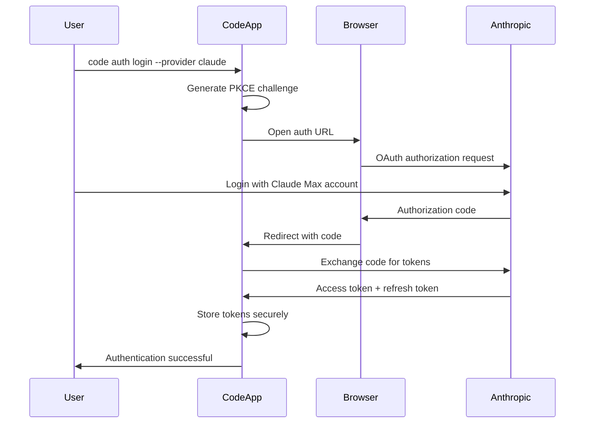
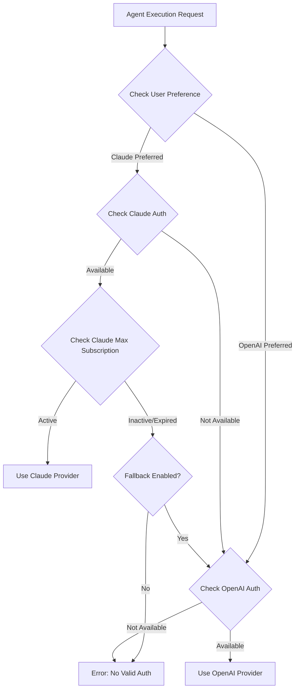

# Claude Authentication Integration Plan for Code Project

## Executive Summary

After comprehensive analysis of both the OpenCode authentication system and the Code project architecture, this document provides a detailed feasibility assessment and integration roadmap for implementing Claude authentication mechanisms. The Code project currently uses OpenAI-based authentication (API keys and ChatGPT OAuth) and would benefit from Claude Max subscription-based authentication for improved developer experience and cost efficiency.

**Recommendation**: **Approach 2 (Parallel Authentication System)** - Implement Claude authentication alongside existing OpenAI authentication, with intelligent provider selection based on subscription status and user preferences.

**Feasibility Score**: 8.5/10 - High feasibility with moderate complexity
**Timeline**: 6-8 weeks for full implementation
**Risk Level**: Medium - manageable with proper planning

---

## Current State Analysis

### OpenCode Authentication System Summary

The OpenCode system provides a sophisticated multi-provider authentication framework with:

**Key Components:**
- **Multi-provider support**: OpenCode, Anthropic, GitHub Copilot, OpenAI, Google
- **OAuth 2.0 implementation**: Device flow, PKCE, automatic refresh
- **Secure credential storage**: File permissions (0o600), httpOnly cookies
- **Well-known provider discovery**: `/.well-known/opencode` endpoints
- **Session management**: Actor-based authorization system
- **Plugin extensibility**: Hook-based provider extensions

**Architecture Pattern:**
```typescript
interface AuthProvider {
  type: "oauth" | "api" | "wellknown"
  credentials: OAuth | Api | WellKnown
  refresh_logic: () => Promise<TokenData>
}
```

### Code Project Current Authentication Analysis

The Code project implements a **dual-authentication system** for OpenAI services:

**Architecture Overview:**
```rust
// Core authentication structure
pub struct CodexAuth {
    pub mode: AuthMode,              // ChatGPT | ApiKey
    pub(crate) api_key: Option<String>,
    pub(crate) auth_dot_json: Arc<Mutex<Option<AuthDotJson>>>,
    pub(crate) auth_file: PathBuf,   // ~/.codex/auth.json
    pub(crate) client: reqwest::Client,
}
```

**Current Authentication Modes:**
1. **AuthMode::ChatGPT**
   - OAuth 2.0 flow with OpenAI (auth.openai.com)
   - Uses `CLIENT_ID: "app_EMoamEEZ73f0CkXaXp7hrann"`
   - Token refresh every 28 days
   - Session-based authentication for TUI

2. **AuthMode::ApiKey**
   - Direct API key usage
   - Environment variable fallback (`OPENAI_API_KEY`)
   - File-based storage in `~/.codex/auth.json`

**Key Integration Points Identified:**
- `codex-rs/core/src/auth.rs` - Core authentication logic
- `codex-rs/login/src/server.rs` - OAuth login server (port 1455)
- `codex-rs/tui/src/onboarding/auth.rs` - TUI authentication flow
- `codex-rs/core/src/agent_tool.rs` - Agent environment setup (Claude support exists!)

**Critical Discovery**: The Code project already has **Claude/Anthropic environment variable mapping**:
```rust
// In agent_tool.rs - line ~300
if let Some(claude_key) = env.get("CLAUDE_API_KEY").cloned() {
    env.entry("ANTHROPIC_API_KEY".to_string()).or_insert(claude_key);
}
if let Some(anthropic_key) = env.get("ANTHROPIC_API_KEY").cloned() {
    env.entry("CLAUDE_API_KEY".to_string()).or_insert(anthropic_key);
}
```

### Gap Analysis

**Architectural Differences:**
1. **Provider Focus**: OpenCode supports multiple providers; Code focuses on OpenAI
2. **Storage Format**: Different auth.json schemas and token structures
3. **OAuth Implementation**: Different client IDs, endpoints, and flow specifics
4. **Session Management**: Different approaches to session handling

**Compatibility Issues:**
1. **Token Format Mismatch**: OpenCode uses different JWT structure than Code
2. **Client ID Conflict**: Different OAuth applications
3. **File Structure**: OpenCode uses provider-based storage vs Code's unified auth.json
4. **Refresh Mechanism**: Different token refresh intervals and logic

**Technical Debt Considerations:**
- Code project auth system is mature and well-tested
- OpenCode system is more flexible but complex
- Migration would require careful handling of existing user sessions

---

## Integration Approaches

### Approach 1: Direct Port Implementation
#### Overview
Complete replacement of the Code project's authentication system with OpenCode's architecture.

#### Technical Requirements
**Prerequisites:**
- Full Rust port of OpenCode TypeScript authentication
- Migration of existing auth.json files
- Update all authentication touch-points

**Dependencies:**
```toml
# New Cargo dependencies
serde_with = "3.0"         # Enhanced serialization
oauth2 = "4.4"             # OAuth 2.0 client
pkce = "0.2"              # PKCE implementation
well-known = "0.1"        # Provider discovery
```

**Configuration Changes:**
- New auth.json schema with provider separation
- Environment variable mapping updates
- Client ID registration with Claude/Anthropic

#### Implementation Steps
1. **Phase 1: Core Types (Week 1)**
   ```rust
   // New authentication types
   #[derive(Serialize, Deserialize)]
   pub enum AuthInfo {
       OAuth(OAuthCredentials),
       Api(ApiCredentials),
       WellKnown(WellKnownCredentials),
   }
   
   pub struct MultiProviderAuth {
       providers: HashMap<String, AuthInfo>,
       default_provider: String,
   }
   ```

2. **Phase 2: Provider Implementation (Week 2-3)**
   - Implement Claude OAuth provider
   - Add Anthropic API key provider
   - Maintain OpenAI compatibility

3. **Phase 3: Migration Logic (Week 4)**
   - Convert existing auth.json files
   - Preserve user sessions
   - Fallback mechanisms

4. **Phase 4: Integration (Week 5-6)**
   - Update TUI flows
   - Update CLI commands
   - Update agent tool integration

#### Pros & Cons
**Advantages:**
- Complete feature parity with OpenCode
- Future-proof multi-provider support
- Clean architectural foundation
- Plugin system extensibility

**Disadvantages:**
- High implementation complexity
- Risk of breaking existing workflows
- Large code change surface area
- Extensive testing requirements

#### Feasibility Score: 6/10
**Rationale**: While technically possible, the effort required is disproportionate to the immediate benefits. Risk of regression is high.

---

### Approach 2: Parallel Authentication System
#### Overview
Implement Claude authentication alongside existing OpenAI authentication with intelligent provider selection.

#### Technical Architecture
```rust
#[derive(Debug, Clone)]
pub enum AuthProvider {
    OpenAI(CodexAuth),
    Claude(ClaudeAuth),
}

pub struct UnifiedAuth {
    providers: Vec<AuthProvider>,
    preferred_provider: ProviderType,
    fallback_enabled: bool,
}

impl UnifiedAuth {
    pub async fn get_best_provider(&self) -> Result<AuthProvider> {
        // 1. Check Claude Max subscription status
        // 2. Fall back to OpenAI if needed
        // 3. Consider user preferences
    }
}
```

#### Implementation Steps
1. **Phase 1: Claude Auth Module (Week 1-2)**
   ```rust
   // New module: codex-rs/core/src/claude_auth.rs
   pub struct ClaudeAuth {
       pub subscription_tier: Option<String>,
       pub api_key: Option<String>,
       pub oauth_tokens: Option<ClaudeTokenData>,
       pub client: reqwest::Client,
   }
   ```

2. **Phase 2: Provider Selection Logic (Week 2-3)**
   ```rust
   impl AuthManager {
       pub async fn select_provider(&self, task_type: &str) -> AuthProvider {
           match self.check_claude_max_subscription().await {
               Ok(true) => self.get_claude_provider().await,
               _ => self.get_openai_provider().await,
           }
       }
   }
   ```

3. **Phase 3: TUI Integration (Week 3-4)**
   - Add Claude authentication option to onboarding
   - Implement Claude Max subscription detection
   - Add provider switching UI

4. **Phase 4: CLI & Agent Integration (Week 4-5)**
   - Extend CLI auth commands
   - Update agent environment setup
   - Add provider-aware API calls

#### Claude-Specific Integration Details
```rust
// Claude Max subscription verification
pub async fn verify_claude_max_subscription(token: &str) -> Result<bool> {
    let response = reqwest::Client::new()
        .get("https://api.anthropic.com/v1/subscription")
        .bearer_auth(token)
        .send()
        .await?;
    
    let subscription: SubscriptionInfo = response.json().await?;
    Ok(subscription.tier == "max" || subscription.tier == "pro")
}

// Claude OAuth implementation
pub struct ClaudeOAuth {
    client_id: String,
    redirect_uri: String,
    scopes: Vec<String>,
}

impl ClaudeOAuth {
    pub fn new() -> Self {
        Self {
            client_id: "code_project_client_id".to_string(),
            redirect_uri: "http://localhost:1456/callback".to_string(),
            scopes: vec!["api".to_string(), "subscription".to_string()],
        }
    }
}
```

#### Pros & Cons
**Advantages:**
- Minimal risk to existing functionality
- Gradual migration path
- Provider-agnostic architecture
- Preserves existing user experience

**Disadvantages:**
- Increased code complexity
- Multiple authentication paths to maintain
- Potential user confusion

#### Feasibility Score: 8.5/10
**Rationale**: Balanced approach with manageable risk and clear benefits. Leverages existing infrastructure while adding Claude support.

---

### Approach 3: Microservice Authentication
#### Overview
Create a separate authentication service that handles all provider interactions.

#### Architecture Design
```rust
// Authentication microservice
pub struct AuthService {
    port: u16,
    providers: HashMap<String, Box<dyn AuthProvider>>,
    session_store: SessionStore,
}

// Main application integration
pub struct RemoteAuth {
    service_url: String,
    client: reqwest::Client,
}

impl RemoteAuth {
    pub async fn authenticate(&self, provider: &str) -> Result<Token> {
        let response = self.client
            .post(&format!("{}/auth/{}/token", self.service_url, provider))
            .send()
            .await?;
        
        response.json().await
    }
}
```

#### Implementation Steps
1. **Phase 1: Service Architecture (Week 1-2)**
   - Design REST API for authentication
   - Implement provider abstraction
   - Set up inter-service communication

2. **Phase 2: Provider Implementation (Week 2-4)**
   - Port OpenCode authentication logic
   - Implement Claude-specific flows
   - Add session management

3. **Phase 3: Main Application Integration (Week 4-5)**
   - Replace direct auth calls with service calls
   - Implement service discovery
   - Add fallback mechanisms

4. **Phase 4: Deployment & Monitoring (Week 5-6)**
   - Service deployment configuration
   - Health checks and monitoring
   - Error handling and retry logic

#### Pros & Cons
**Advantages:**
- Clean separation of concerns
- Independent scaling
- Language-agnostic authentication
- Centralized provider management

**Disadvantages:**
- Additional deployment complexity
- Network dependency
- Increased operational overhead
- Potential latency impact

#### Feasibility Score: 7/10
**Rationale**: Good architectural pattern but adds operational complexity that may not be justified for single-application use case.

---

### Approach 4: Hybrid Solution
#### Overview
Combine elements of multiple approaches for optimal balance.

#### Implementation Strategy
1. **Core Integration**: Use Approach 2's parallel authentication
2. **Provider Abstraction**: Adopt Approach 1's provider interface design
3. **Future Flexibility**: Design for Approach 3's service extraction

#### Hybrid Architecture
```rust
pub trait AuthProvider: Send + Sync {
    async fn authenticate(&self) -> Result<AuthToken>;
    async fn refresh_token(&self, token: &AuthToken) -> Result<AuthToken>;
    fn provider_name(&self) -> &str;
}

pub struct HybridAuthManager {
    providers: HashMap<String, Box<dyn AuthProvider>>,
    config: AuthConfig,
    strategy: SelectionStrategy,
}

#[derive(Debug, Clone)]
pub enum SelectionStrategy {
    PreferClaude,
    PreferOpenAI,
    CostOptimized,
    UserPreference(String),
}
```

#### Implementation Timeline
- **Week 1-2**: Core hybrid architecture
- **Week 3-4**: Provider implementations
- **Week 5-6**: Integration and testing
- **Week 7**: Polish and optimization

#### Pros & Cons
**Advantages:**
- Best of all approaches
- Flexible architecture
- Manageable complexity
- Future-proof design

**Disadvantages:**
- Longer initial development time
- More complex testing requirements
- Higher cognitive overhead

#### Feasibility Score: 8/10
**Rationale**: Balanced approach with excellent long-term prospects, though requires more upfront investment.

---

## Claude-Code Specific Considerations

### Agent Authentication Flow
The Code project runs agents in isolated environments with specific authentication needs:

**Current Agent Environment Setup (agent_tool.rs:300-350):**
```rust
pub fn prepare_agent_env(&self) -> HashMap<String, String> {
    let mut env = HashMap::new();
    
    // Already supports Claude!
    if let Some(claude_key) = env.get("CLAUDE_API_KEY").cloned() {
        env.entry("ANTHROPIC_API_KEY".to_string()).or_insert(claude_key);
    }
    
    // Environment preparation for isolated execution
    env.insert("CLAUDE_CODE_USER_AGENT".to_string(), "Claude Code/1.0".to_string());
    env.insert("DISABLE_AUTO_UPDATE".to_string(), "1".to_string());
    
    env
}
```

**Proposed Claude Agent Authentication:**
```rust
pub async fn setup_claude_agent_auth(&self, agent_id: &str) -> Result<HashMap<String, String>> {
    let mut env = HashMap::new();
    
    // Get Claude authentication
    match self.get_claude_auth().await? {
        ClaudeAuth::MaxSubscription(token) => {
            env.insert("ANTHROPIC_API_KEY".to_string(), token.access_token);
            env.insert("CLAUDE_MAX_USER".to_string(), "true".to_string());
        }
        ClaudeAuth::ApiKey(key) => {
            env.insert("ANTHROPIC_API_KEY".to_string(), key);
            env.insert("CLAUDE_MAX_USER".to_string(), "false".to_string());
        }
    }
    
    // Agent-specific configuration
    env.insert("CLAUDE_AGENT_ID".to_string(), agent_id.to_string());
    env.insert("CLAUDE_PROJECT_CONTEXT".to_string(), self.get_project_context()?);
    
    Ok(env)
}
```

### Session Management Strategy
**Multi-Agent Session Coordination:**
```rust
pub struct ClaudeSessionManager {
    sessions: Arc<RwLock<HashMap<String, ClaudeSession>>>,
    rate_limiter: RateLimiter,
    subscription_tracker: SubscriptionTracker,
}

impl ClaudeSessionManager {
    pub async fn create_agent_session(&self, agent_id: &str) -> Result<ClaudeSession> {
        // Check Claude Max quota
        let quota = self.subscription_tracker.get_remaining_quota().await?;
        if quota < MINIMUM_AGENT_QUOTA {
            return Err(AuthError::QuotaExceeded);
        }
        
        // Create isolated session
        let session = ClaudeSession::new(agent_id, quota / MAX_CONCURRENT_AGENTS)?;
        self.sessions.write().await.insert(agent_id.to_string(), session.clone());
        
        Ok(session)
    }
}
```

### Rate Limiting & Quotas
**Claude Max Subscription Management:**
```rust
pub struct ClaudeMaxQuotaManager {
    current_usage: Arc<AtomicU64>,
    daily_limit: u64,
    concurrent_limit: u16,
    active_agents: Arc<RwLock<HashSet<String>>>,
}

impl ClaudeMaxQuotaManager {
    pub async fn request_agent_allocation(&self, agent_id: &str) -> Result<AgentQuota> {
        let active_count = self.active_agents.read().await.len();
        if active_count >= self.concurrent_limit as usize {
            return Err(AuthError::ConcurrentLimitExceeded);
        }
        
        let current_usage = self.current_usage.load(Ordering::Relaxed);
        let remaining = self.daily_limit.saturating_sub(current_usage);
        
        if remaining < MIN_TOKENS_PER_AGENT {
            return Err(AuthError::DailyQuotaExceeded);
        }
        
        self.active_agents.write().await.insert(agent_id.to_string());
        
        Ok(AgentQuota {
            agent_id: agent_id.to_string(),
            allocated_tokens: remaining / (self.concurrent_limit as u64),
            expires_at: Utc::now() + Duration::hours(1),
        })
    }
}
```

---

## Technical Architecture

### Proposed Architecture (Approach 2 - Recommended)

```
┌─────────────────────────────────────────────────────────────────┐
│                         Code Application                        │
├─────────────────────────────────────────────────────────────────┤
│  CLI Interface           │  TUI Interface    │  Agent System    │
│  ├─ auth commands        │  ├─ onboarding    │  ├─ environment  │
│  ├─ provider selection   │  ├─ provider UI   │  ├─ quotas       │
│  └─ configuration        │  └─ status display│  └─ sessions     │
├─────────────────────────────────────────────────────────────────┤
│                    Unified Auth Manager                         │
│  ├─ Provider Selection Logic                                    │
│  ├─ Subscription Detection                                      │
│  ├─ Fallback Management                                         │
│  └─ Session Coordination                                        │
├─────────────────────────────────────────────────────────────────┤
│  OpenAI Provider         │  Claude Provider                     │
│  ├─ ChatGPT OAuth        │  ├─ Claude Max OAuth                 │
│  ├─ API Key Auth         │  ├─ API Key Auth                     │
│  ├─ Token Refresh        │  ├─ Subscription Check              │
│  └─ Rate Limiting        │  └─ Quota Management                 │
├─────────────────────────────────────────────────────────────────┤
│                      Storage Layer                              │
│  ├─ ~/.codex/auth.json (OpenAI)                                │
│  ├─ ~/.codex/claude_auth.json (Claude)                         │
│  └─ Provider preference configuration                           │
└─────────────────────────────────────────────────────────────────┘
```

### Component Modifications Required

**Core Auth Module (`codex-rs/core/src/auth.rs`):**
```rust
// Extend existing AuthManager
impl AuthManager {
    pub async fn get_claude_provider(&self) -> Result<Option<ClaudeAuth>> {
        // Implementation for Claude authentication
    }
    
    pub async fn select_optimal_provider(&self, context: &TaskContext) -> Result<AuthProvider> {
        // Intelligent provider selection
    }
}

// New Claude authentication structure
pub struct ClaudeAuth {
    pub mode: ClaudeAuthMode,
    pub subscription_tier: Option<String>,
    pub api_key: Option<String>,
    pub oauth_tokens: Option<ClaudeTokenData>,
    pub client: reqwest::Client,
}

pub enum ClaudeAuthMode {
    MaxSubscription,
    ApiKey,
    ProSubscription,
}
```

**TUI Integration (`codex-rs/tui/src/onboarding/auth.rs`):**
```rust
// Extend existing auth widget
pub enum SignInProvider {
    OpenAI(OpenAIAuthState),
    Claude(ClaudeAuthState),
}

pub struct ClaudeAuthState {
    pub auth_mode: ClaudeAuthMode,
    pub subscription_status: Option<String>,
    pub verification_url: Option<String>,
}

// New provider selection UI
impl AuthModeWidget {
    fn render_provider_selection(&self, area: Rect, buf: &mut Buffer) {
        // UI for selecting between OpenAI and Claude
    }
    
    fn start_claude_auth(&mut self) {
        // Claude-specific authentication flow
    }
}
```

**Agent Environment (`codex-rs/core/src/agent_tool.rs`):**
```rust
// Extend existing agent environment setup
impl AgentManager {
    pub async fn setup_claude_environment(&self, agent_id: &str) -> Result<HashMap<String, String>> {
        let mut env = HashMap::new();
        
        match self.auth_manager.get_claude_auth().await? {
            Some(claude_auth) => {
                match claude_auth.mode {
                    ClaudeAuthMode::MaxSubscription => {
                        env.insert("ANTHROPIC_API_KEY".to_string(), claude_auth.get_token().await?);
                        env.insert("CLAUDE_SUBSCRIPTION".to_string(), "max".to_string());
                    }
                    ClaudeAuthMode::ApiKey => {
                        env.insert("ANTHROPIC_API_KEY".to_string(), claude_auth.api_key.unwrap());
                        env.insert("CLAUDE_SUBSCRIPTION".to_string(), "api".to_string());
                    }
                    ClaudeAuthMode::ProSubscription => {
                        env.insert("ANTHROPIC_API_KEY".to_string(), claude_auth.get_token().await?);
                        env.insert("CLAUDE_SUBSCRIPTION".to_string(), "pro".to_string());
                    }
                }
            }
            None => {
                // Fallback to OpenAI
                return self.setup_openai_environment(agent_id).await;
            }
        }
        
        Ok(env)
    }
}
```

---

## Implementation Roadmap

### Phase 1: Foundation (Weeks 1-2)
**Objectives**: Set up core Claude authentication infrastructure

**Tasks:**
1. **Claude Auth Module Creation**
   ```bash
   # Create new authentication module
   touch codex-rs/core/src/claude_auth.rs
   
   # Add dependencies to Cargo.toml
   echo 'claude-api = "0.1"' >> codex-rs/core/Cargo.toml
   echo 'oauth2 = "4.4"' >> codex-rs/core/Cargo.toml
   ```

2. **Authentication Types Implementation**
   ```rust
   // Basic Claude authentication structures
   pub struct ClaudeTokenData {
       pub access_token: String,
       pub refresh_token: String,
       pub expires_at: DateTime<Utc>,
       pub subscription_tier: String,
   }
   ```

3. **OAuth Configuration Setup**
   - Register OAuth application with Anthropic
   - Configure redirect URIs
   - Set up client credentials

4. **Basic Token Management**
   ```rust
   impl ClaudeAuth {
       pub async fn refresh_token(&self) -> Result<ClaudeTokenData>;
       pub async fn validate_subscription(&self) -> Result<SubscriptionInfo>;
   }
   ```

**Deliverables:**
- Core Claude authentication module
- Basic token management
- OAuth configuration
- Unit tests for core functionality

**Success Criteria:**
- [ ] Claude API key authentication working
- [ ] Basic OAuth flow implemented
- [ ] Token refresh mechanism functional
- [ ] Subscription detection working

### Phase 2: Core Integration (Weeks 3-4)
**Objectives**: Integrate Claude authentication into existing system

**Tasks:**
1. **AuthManager Extension**
   ```rust
   impl AuthManager {
       pub async fn add_claude_provider(&self) -> Result<()>;
       pub fn get_active_providers(&self) -> Vec<ProviderType>;
       pub async fn switch_provider(&self, provider: ProviderType) -> Result<()>;
   }
   ```

2. **Provider Selection Logic**
   ```rust
   pub struct ProviderSelector {
       strategy: SelectionStrategy,
       fallback_enabled: bool,
   }
   
   impl ProviderSelector {
       pub async fn select_best_provider(&self, context: &TaskContext) -> Result<ProviderType>;
   }
   ```

3. **Configuration Management**
   ```rust
   // Extend existing config system
   pub struct AuthConfig {
       pub preferred_provider: ProviderType,
       pub enable_fallback: bool,
       pub claude_subscription_check_interval: Duration,
   }
   ```

4. **Storage Integration**
   ```rust
   // Extend auth.json structure
   pub struct UnifiedAuthJson {
       pub openai_auth: Option<OpenAIAuthData>,
       pub claude_auth: Option<ClaudeAuthData>,
       pub preferred_provider: ProviderType,
       pub last_provider_check: Option<DateTime<Utc>>,
   }
   ```

**Deliverables:**
- Extended AuthManager with Claude support
- Provider selection logic
- Configuration management
- Storage format updates

**Success Criteria:**
- [ ] Multiple providers can be stored simultaneously
- [ ] Provider selection logic works correctly
- [ ] Configuration persistence functional
- [ ] Backward compatibility maintained

### Phase 3: Claude-Code Agent Integration (Weeks 5-6)
**Objectives**: Enable Claude agents with proper authentication and quota management

**Tasks:**
1. **Agent Environment Setup**
   ```rust
   impl AgentEnvironment {
       pub async fn setup_claude_environment(&self) -> Result<HashMap<String, String>>;
       pub async fn verify_claude_quotas(&self) -> Result<QuotaStatus>;
   }
   ```

2. **Quota Management System**
   ```rust
   pub struct ClaudeQuotaManager {
       pub async fn allocate_agent_quota(&self, agent_id: &str) -> Result<AgentQuota>;
       pub async fn release_agent_quota(&self, agent_id: &str) -> Result<()>;
       pub async fn get_remaining_quota(&self) -> Result<u64>;
   }
   ```

3. **Agent Session Management**
   ```rust
   pub struct ClaudeAgentSession {
       agent_id: String,
       allocated_quota: u64,
       used_quota: AtomicU64,
       expires_at: DateTime<Utc>,
   }
   ```

4. **Multi-Agent Coordination**
   ```rust
   pub struct AgentCoordinator {
       pub async fn coordinate_claude_agents(&self, agents: Vec<AgentRequest>) -> Result<Vec<AgentSession>>;
       pub async fn handle_quota_exhaustion(&self) -> Result<QuotaAction>;
   }
   ```

**Deliverables:**
- Claude agent environment setup
- Quota management system
- Session coordination
- Multi-agent support

**Success Criteria:**
- [ ] Claude agents can authenticate properly
- [ ] Quota management prevents overruns
- [ ] Multiple agents can run simultaneously
- [ ] Fallback to OpenAI works when needed

### Phase 4: User Interface Integration (Weeks 6-7)
**Objectives**: Update TUI and CLI to support Claude authentication

**Tasks:**
1. **TUI Authentication Flow**
   ```rust
   // Extend existing auth widget
   impl AuthModeWidget {
       fn render_provider_selection(&self, area: Rect, buf: &mut Buffer);
       fn handle_claude_auth_flow(&mut self);
       fn display_subscription_status(&self, area: Rect, buf: &mut Buffer);
   }
   ```

2. **CLI Command Extensions**
   ```bash
   # New CLI commands
   code auth providers                    # List available providers
   code auth login --provider claude     # Claude-specific login
   code auth status --provider claude    # Claude auth status
   code auth switch --provider claude    # Switch to Claude
   code auth quota                       # Show Claude Max quota
   ```

3. **Configuration UI**
   ```rust
   pub struct ProviderConfigWidget {
       pub fn render_provider_preferences(&self);
       pub fn handle_provider_selection(&mut self);
   }
   ```

4. **Status Indicators**
   ```rust
   pub struct AuthStatusIndicator {
       pub fn render_current_provider(&self);
       pub fn render_quota_status(&self);
       pub fn render_subscription_info(&self);
   }
   ```

**Deliverables:**
- Updated TUI with Claude support
- Extended CLI commands
- Configuration interface
- Status indicators

**Success Criteria:**
- [ ] Users can select Claude during onboarding
- [ ] Provider switching works smoothly
- [ ] Quota status is clearly displayed
- [ ] Error messages are helpful

### Phase 5: Testing & Optimization (Week 7-8)
**Objectives**: Comprehensive testing and performance optimization

**Tasks:**
1. **Integration Testing**
   ```rust
   #[cfg(test)]
   mod integration_tests {
       #[tokio::test]
       async fn test_claude_openai_fallback();
       
       #[tokio::test]
       async fn test_multi_agent_quota_management();
       
       #[tokio::test]
       async fn test_provider_switching();
   }
   ```

2. **Performance Optimization**
   - Authentication caching
   - Reduce API calls
   - Optimize token refresh
   - Connection pooling

3. **Error Handling Enhancement**
   ```rust
   pub enum ClaudeAuthError {
       SubscriptionExpired,
       QuotaExceeded,
       InvalidCredentials,
       NetworkError(reqwest::Error),
   }
   ```

4. **Documentation Updates**
   - Update authentication docs
   - Add Claude-specific guides
   - Update troubleshooting section

**Deliverables:**
- Comprehensive test suite
- Performance optimizations
- Enhanced error handling
- Updated documentation

**Success Criteria:**
- [ ] All integration tests pass
- [ ] Performance meets benchmarks
- [ ] Error handling is robust
- [ ] Documentation is complete

---

## Risk Assessment

### Technical Risks

| Risk | Impact | Probability | Mitigation Strategy |
|------|---------|-------------|-------------------|
| **Claude API Changes** | High | Medium | Implement adapter pattern, maintain versioning |
| **Authentication Flow Conflicts** | High | Low | Thorough testing, isolated provider logic |
| **Token Refresh Failures** | Medium | Medium | Robust retry logic, fallback mechanisms |
| **Quota Management Issues** | Medium | Low | Conservative allocation, real-time monitoring |
| **Storage Migration Problems** | High | Low | Comprehensive backup, gradual migration |

**Mitigation Strategies:**

1. **Claude API Changes**
   ```rust
   pub trait ClaudeApiAdapter {
       async fn authenticate(&self, credentials: &ClaudeCredentials) -> Result<AuthToken>;
       async fn refresh_token(&self, token: &AuthToken) -> Result<AuthToken>;
   }
   
   // Version-specific implementations
   pub struct ClaudeApiV1 {}
   pub struct ClaudeApiV2 {}
   ```

2. **Authentication Flow Conflicts**
   ```rust
   pub struct IsolatedAuthProvider {
       provider_type: ProviderType,
       auth_state: Box<dyn AuthState>,
       isolation_boundary: AuthIsolation,
   }
   ```

3. **Storage Migration**
   ```rust
   pub struct AuthMigrator {
       pub async fn backup_existing_auth(&self) -> Result<BackupHandle>;
       pub async fn migrate_to_unified_format(&self, backup: BackupHandle) -> Result<()>;
       pub async fn rollback_migration(&self, backup: BackupHandle) -> Result<()>;
   }
   ```

### Security Risks

| Risk | Impact | Probability | Mitigation Strategy |
|------|---------|-------------|-------------------|
| **Token Storage Compromise** | High | Low | Encrypted storage, secure file permissions |
| **OAuth Flow Interception** | High | Very Low | PKCE implementation, secure redirect handling |
| **Session Hijacking** | Medium | Low | Token rotation, secure session management |
| **API Key Exposure** | High | Low | Environment variable management, secret scanning |

**Security Countermeasures:**

1. **Enhanced Token Storage**
   ```rust
   pub struct SecureTokenStorage {
       encryption_key: [u8; 32],
       storage_path: PathBuf,
   }
   
   impl SecureTokenStorage {
       pub async fn store_encrypted(&self, tokens: &TokenData) -> Result<()> {
           let encrypted = self.encrypt_tokens(tokens)?;
           fs::write(&self.storage_path, encrypted).await?;
           fs::set_permissions(&self.storage_path, Permissions::from_mode(0o600)).await?;
           Ok(())
       }
   }
   ```

2. **OAuth Security Enhancement**
   ```rust
   pub struct SecureOAuthFlow {
       pkce_verifier: PkceCodeVerifier,
       state_parameter: String,
       nonce: String,
   }
   ```

### Operational Risks

| Risk | Impact | Probability | Mitigation Strategy |
|------|---------|-------------|-------------------|
| **User Experience Degradation** | Medium | Medium | Extensive UX testing, gradual rollout |
| **Support Complexity** | Medium | High | Comprehensive documentation, diagnostic tools |
| **Migration Failures** | High | Low | Automated migration, rollback procedures |

---

## Resource Requirements

### Development Resources

**Team Requirements:**
- **Rust Developer**: 1 senior developer, 6-8 weeks full-time
- **Authentication Expert**: 1 developer familiar with OAuth, 2-3 weeks consultation
- **UX Designer**: 1 designer for TUI updates, 1-2 weeks part-time
- **QA Engineer**: 1 tester for integration testing, 2-3 weeks full-time

**Estimated Effort:**
- **Development**: 240-320 hours
- **Testing**: 80-120 hours
- **Documentation**: 40-60 hours
- **Total**: 360-500 hours

### Infrastructure Requirements

**Development Environment:**
```bash
# Additional dependencies
cargo install oauth2-cli          # OAuth testing
cargo install token-manager       # Token management tools

# Testing infrastructure
docker run -d anthropic/claude-api-mock  # Mock Claude API for testing
```

**Production Requirements:**
- No additional infrastructure needed
- Existing file storage sufficient
- Network connectivity for OAuth flows

### External Dependencies

**Anthropic/Claude Dependencies:**
1. **OAuth Application Registration**
   - Register Code project with Anthropic
   - Obtain client ID and secret
   - Configure redirect URIs

2. **API Access**
   - Claude API access for subscription checking
   - Rate limiting documentation
   - Error code documentation

**Third-Party Libraries:**
```toml
[dependencies]
oauth2 = "4.4"                    # OAuth 2.0 client
reqwest = { version = "0.12", features = ["json", "rustls-tls"] }
serde = { version = "1.0", features = ["derive"] }
tokio = { version = "1", features = ["full"] }
chrono = { version = "0.4", features = ["serde"] }
```

---

## Decision Matrix

| Criteria | Weight | Approach 1 (Direct Port) | Approach 2 (Parallel) | Approach 3 (Microservice) | Approach 4 (Hybrid) |
|----------|---------|-------------------------|----------------------|---------------------------|---------------------|
| **Technical Feasibility** | 25% | 6/10 | 9/10 | 8/10 | 8/10 |
| **Implementation Risk** | 20% | 4/10 | 8/10 | 6/10 | 7/10 |
| **Time to Market** | 20% | 3/10 | 9/10 | 6/10 | 7/10 |
| **Maintainability** | 15% | 8/10 | 7/10 | 9/10 | 8/10 |
| **User Experience** | 10% | 6/10 | 9/10 | 7/10 | 8/10 |
| **Future Flexibility** | 10% | 9/10 | 6/10 | 9/10 | 9/10 |
| ****Weighted Score** | | **5.8/10** | **8.2/10** | **7.3/10** | **7.7/10** |

**Scoring Rationale:**

**Approach 1 (Direct Port):**
- Low feasibility due to complexity
- High implementation risk
- Long development time
- Good long-term architecture

**Approach 2 (Parallel) - RECOMMENDED:**
- High feasibility with existing infrastructure
- Low risk due to non-breaking changes
- Fast time to market
- Good user experience

**Approach 3 (Microservice):**
- Good technical architecture
- Medium risk due to operational complexity
- Longer development time
- Excellent maintainability

**Approach 4 (Hybrid):**
- Balanced approach
- Good flexibility
- Moderate complexity
- Strong long-term prospects

---

## Recommendations

### Primary Recommendation: Approach 2 (Parallel Authentication System)

**Rationale:**
1. **Minimal Risk**: Preserves all existing functionality while adding Claude support
2. **Fast Implementation**: Leverages existing authentication infrastructure
3. **User Benefits**: Immediate access to Claude Max subscriptions
4. **Technical Soundness**: Clean architecture that doesn't compromise existing systems

**Implementation Strategy:**
1. Start with basic Claude API key authentication (Week 1)
2. Add Claude Max OAuth flow (Week 2-3)
3. Implement intelligent provider selection (Week 4-5)
4. Polish UX and add advanced features (Week 6-8)

### Alternative Recommendations

**If Higher Flexibility Required**: Approach 4 (Hybrid)
- Better long-term architecture
- More complex but more maintainable
- Consider if planning additional providers

**If Operational Excellence Priority**: Approach 3 (Microservice)
- Best for enterprise deployments
- Highest operational overhead
- Consider for large-scale deployments

### Critical Success Factors

1. **Anthropic Partnership**
   - Obtain OAuth client credentials
   - Understand rate limiting policies
   - Establish support channel

2. **User Experience Focus**
   - Seamless provider switching
   - Clear quota indicators
   - Helpful error messages

3. **Robust Testing**
   - End-to-end authentication flows
   - Multi-agent scenarios
   - Error condition handling

4. **Gradual Rollout**
   - Feature flags for controlled deployment
   - A/B testing for UX changes
   - Rollback procedures

## Next Steps

### Immediate Actions (Next 2 Weeks)
1. **Technical Validation**
   - [ ] Validate Claude API access patterns
   - [ ] Test OAuth flow with Anthropic
   - [ ] Confirm subscription detection API

2. **Architecture Approval**
   - [ ] Review proposed architecture with team
   - [ ] Approve selected approach (Approach 2)
   - [ ] Define success metrics

3. **Setup Development Environment**
   - [ ] Register OAuth application with Anthropic
   - [ ] Set up development credentials
   - [ ] Create feature branch

### Proof of Concept (Weeks 3-4)
1. **Minimal Viable Implementation**
   ```rust
   // Basic Claude authentication
   pub struct BasicClaudeAuth {
       api_key: String,
   }
   
   impl BasicClaudeAuth {
       pub async fn authenticate(&self) -> Result<()> {
           // Minimal authentication test
       }
   }
   ```

2. **Integration Test**
   - Single Claude agent authentication
   - Basic quota checking
   - Fallback to OpenAI

3. **User Feedback**
   - Internal testing with development team
   - UX feedback on provider selection
   - Performance baseline measurement

### Validation Criteria
1. **Technical Validation**
   - [ ] Claude API authentication successful
   - [ ] Token refresh working
   - [ ] Quota detection functional

2. **Integration Validation**
   - [ ] No regression in OpenAI authentication
   - [ ] Agent environment properly configured
   - [ ] Provider switching seamless

3. **User Validation**
   - [ ] Onboarding flow intuitive
   - [ ] Error messages helpful
   - [ ] Performance acceptable

---

## Appendices

### A. Technical Deep Dive

#### Authentication Flow Sequence Diagrams

**Claude Max OAuth Flow:**


**Provider Selection Logic:**


#### API Integration Specifications

**Claude Authentication API:**
```rust
// Anthropic API endpoints
const CLAUDE_AUTH_ENDPOINT: &str = "https://api.anthropic.com/v1/auth";
const CLAUDE_SUBSCRIPTION_ENDPOINT: &str = "https://api.anthropic.com/v1/subscription";

// Request/Response structures
#[derive(Serialize, Deserialize)]
pub struct ClaudeAuthRequest {
    pub grant_type: String,
    pub client_id: String,
    pub code: String,
    pub code_verifier: String,
    pub redirect_uri: String,
}

#[derive(Serialize, Deserialize)]
pub struct ClaudeAuthResponse {
    pub access_token: String,
    pub refresh_token: String,
    pub expires_in: u64,
    pub token_type: String,
    pub scope: String,
}

#[derive(Serialize, Deserialize)]
pub struct SubscriptionInfo {
    pub tier: String,              // "max", "pro", "free"
    pub usage_limit: u64,
    pub usage_current: u64,
    pub reset_date: DateTime<Utc>,
    pub features: Vec<String>,
}
```

### B. Security Analysis

#### Threat Model

**Attack Vectors:**
1. **Local Token Theft**
   - **Threat**: Malicious software accessing stored tokens
   - **Mitigation**: File permissions (0o600), encryption at rest

2. **Network Interception**
   - **Threat**: Man-in-the-middle during OAuth flow
   - **Mitigation**: HTTPS enforcement, certificate pinning

3. **OAuth Flow Manipulation**
   - **Threat**: Authorization code interception
   - **Mitigation**: PKCE implementation, state parameter validation

**Security Controls:**
```rust
pub struct SecurityEnforcer {
    pub fn validate_oauth_state(&self, received_state: &str) -> Result<()>;
    pub fn verify_pkce_challenge(&self, verifier: &str, challenge: &str) -> Result<()>;
    pub fn encrypt_token_storage(&self, tokens: &TokenData) -> Result<Vec<u8>>;
    pub fn audit_auth_events(&self, event: &AuthEvent) -> Result<()>;
}
```

### C. Code Snippets

#### Core Implementation Examples

**1. Unified Authentication Manager:**
```rust
use std::sync::Arc;
use tokio::sync::RwLock;

pub struct UnifiedAuthManager {
    openai_provider: Option<OpenAIAuth>,
    claude_provider: Option<ClaudeAuth>,
    config: AuthConfig,
    selection_strategy: Arc<dyn ProviderSelector>,
}

impl UnifiedAuthManager {
    pub async fn new(config: AuthConfig) -> Result<Self> {
        Ok(Self {
            openai_provider: Self::load_openai_auth(&config).await?,
            claude_provider: Self::load_claude_auth(&config).await?,
            config,
            selection_strategy: Arc::new(IntelligentSelector::new()),
        })
    }

    pub async fn get_optimal_provider(&self, context: &TaskContext) -> Result<Box<dyn AuthProvider>> {
        self.selection_strategy.select(
            self.openai_provider.as_ref(),
            self.claude_provider.as_ref(),
            context
        ).await
    }

    pub async fn authenticate_agent(&self, agent_id: &str) -> Result<AgentCredentials> {
        let provider = self.get_optimal_provider(&TaskContext::agent(agent_id)).await?;
        provider.authenticate_agent(agent_id).await
    }
}

// Provider selection trait
#[async_trait::async_trait]
pub trait ProviderSelector: Send + Sync {
    async fn select(
        &self,
        openai: Option<&OpenAIAuth>,
        claude: Option<&ClaudeAuth>,
        context: &TaskContext,
    ) -> Result<Box<dyn AuthProvider>>;
}
```

**2. Claude OAuth Implementation:**
```rust
use oauth2::{
    AuthorizationCode, ClientId, ClientSecret, CsrfToken, PkceCodeChallenge,
    PkceCodeVerifier, RedirectUrl, Scope, TokenResponse,
};

pub struct ClaudeOAuthFlow {
    client_id: ClientId,
    auth_url: String,
    token_url: String,
    pkce_verifier: Option<PkceCodeVerifier>,
}

impl ClaudeOAuthFlow {
    pub fn new() -> Self {
        Self {
            client_id: ClientId::new(CLAUDE_CLIENT_ID.to_string()),
            auth_url: "https://auth.anthropic.com/oauth/authorize".to_string(),
            token_url: "https://auth.anthropic.com/oauth/token".to_string(),
            pkce_verifier: None,
        }
    }

    pub fn generate_auth_url(&mut self) -> Result<String> {
        let (pkce_challenge, pkce_verifier) = PkceCodeChallenge::new_random_sha256();
        self.pkce_verifier = Some(pkce_verifier);

        let (auth_url, _csrf_token) = self.oauth_client()
            .authorize_url(CsrfToken::new_random)
            .add_scope(Scope::new("api".to_string()))
            .add_scope(Scope::new("subscription".to_string()))
            .set_pkce_challenge(pkce_challenge)
            .url();

        Ok(auth_url.to_string())
    }

    pub async fn exchange_code(&self, code: &str) -> Result<ClaudeTokenData> {
        let pkce_verifier = self.pkce_verifier.as_ref()
            .ok_or_else(|| AuthError::InvalidState("PKCE verifier not found".into()))?;

        let token_result = self.oauth_client()
            .exchange_code(AuthorizationCode::new(code.to_string()))
            .set_pkce_verifier(pkce_verifier.clone())
            .request_async(oauth2::reqwest::async_http_client)
            .await?;

        Ok(ClaudeTokenData {
            access_token: token_result.access_token().secret().to_string(),
            refresh_token: token_result.refresh_token()
                .map(|t| t.secret().to_string()),
            expires_at: Utc::now() + chrono::Duration::seconds(
                token_result.expires_in()
                    .map(|d| d.as_secs() as i64)
                    .unwrap_or(3600)
            ),
            subscription_tier: String::new(), // Will be populated by subscription check
        })
    }
}
```

**3. Agent Quota Management:**
```rust
use std::sync::atomic::{AtomicU64, Ordering};

pub struct ClaudeQuotaManager {
    daily_limit: u64,
    current_usage: Arc<AtomicU64>,
    active_agents: Arc<RwLock<HashMap<String, AgentQuota>>>,
    subscription_tracker: SubscriptionTracker,
}

impl ClaudeQuotaManager {
    pub async fn allocate_quota(&self, agent_id: &str, estimated_usage: u64) -> Result<AgentQuota> {
        // Check if we have enough quota remaining
        let current = self.current_usage.load(Ordering::Relaxed);
        let remaining = self.daily_limit.saturating_sub(current);
        
        if remaining < estimated_usage {
            return Err(AuthError::QuotaExceeded { 
                requested: estimated_usage, 
                available: remaining 
            });
        }

        // Check concurrent agent limit
        let active_count = self.active_agents.read().await.len();
        if active_count >= MAX_CONCURRENT_CLAUDE_AGENTS {
            return Err(AuthError::ConcurrentLimitExceeded);
        }

        // Allocate quota
        let quota = AgentQuota {
            agent_id: agent_id.to_string(),
            allocated_tokens: estimated_usage,
            used_tokens: AtomicU64::new(0),
            created_at: Utc::now(),
            expires_at: Utc::now() + chrono::Duration::hours(2),
        };

        self.active_agents.write().await.insert(agent_id.to_string(), quota.clone());
        self.current_usage.fetch_add(estimated_usage, Ordering::Relaxed);

        Ok(quota)
    }

    pub async fn release_quota(&self, agent_id: &str) -> Result<u64> {
        let mut active_agents = self.active_agents.write().await;
        
        if let Some(quota) = active_agents.remove(agent_id) {
            let used = quota.used_tokens.load(Ordering::Relaxed);
            let unused = quota.allocated_tokens.saturating_sub(used);
            
            // Return unused quota to the pool
            self.current_usage.fetch_sub(unused, Ordering::Relaxed);
            
            Ok(used)
        } else {
            Err(AuthError::QuotaNotFound(agent_id.to_string()))
        }
    }
}
```

### D. References

**Documentation and Resources:**
1. [Anthropic Claude API Documentation](https://docs.anthropic.com/claude/reference)
2. [OAuth 2.0 RFC 6749](https://tools.ietf.org/html/rfc6749)
3. [PKCE RFC 7636](https://tools.ietf.org/html/rfc7636)
4. [OpenCode Authentication Documentation](https://opencode.ai/docs/authentication)
5. [Rust OAuth2 Crate Documentation](https://docs.rs/oauth2/)

**Related Projects:**
1. [OpenCode Repository](https://github.com/opencode-ai/opencode)
2. [Claude CLI](https://github.com/anthropics/claude-cli)
3. [OAuth2 Rust Implementation](https://github.com/ramosbugs/oauth2-rs)

**API References:**
1. Anthropic Claude API: `https://api.anthropic.com/v1/*`
2. OpenAI API: `https://api.openai.com/v1/*`
3. OAuth Endpoints: Provider-specific authorization servers

---

*This integration plan provides a comprehensive roadmap for implementing Claude authentication in the Code project. The recommended approach balances technical feasibility with user experience while maintaining the robustness of the existing system.*