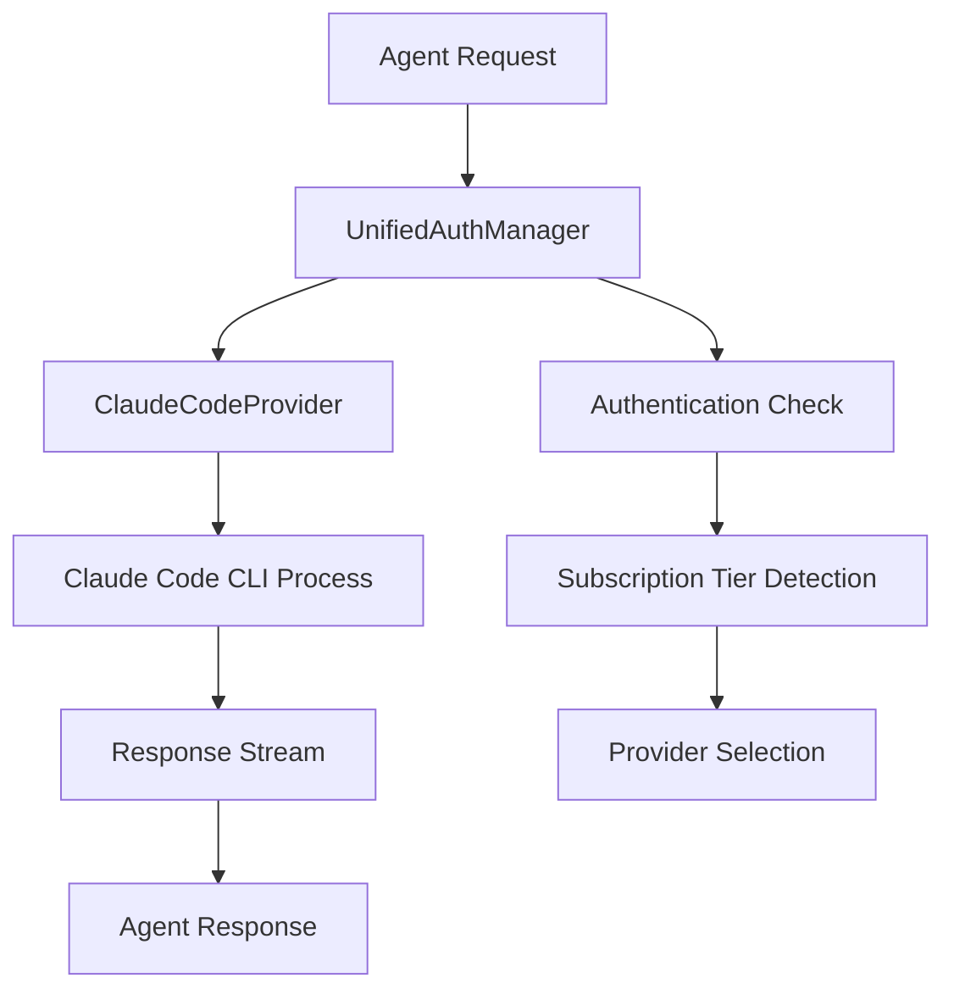

# Claude Code Agent Configuration Guide

## Overview

This guide explains how to configure agents in your system to use Claude Code authentication instead of API keys. This approach allows you to leverage your Claude subscription (Pro/Max/Team) without incurring additional API costs.

## Table of Contents

1. [Prerequisites](#prerequisites)
2. [Understanding the Integration](#understanding-the-integration)
3. [Basic Configuration](#basic-configuration)
4. [Agent Configuration](#agent-configuration)
5. [Advanced Settings](#advanced-settings)
6. [Workflow Integration](#workflow-integration)
7. [Troubleshooting](#troubleshooting)
8. [Security Considerations](#security-considerations)

## Prerequisites

Before configuring agents to use Claude Code authentication, ensure you have:

- **Claude Code CLI installed** and authenticated
- **Valid Claude subscription** (Pro, Max, or Team)
- **Proper system permissions** for agent spawning
- **Network connectivity** for authentication verification

### Verify Claude Code Installation

```bash
# Check if Claude Code is installed and in PATH
claude auth status

# Expected output for authenticated user:
# ✓ Authenticated as your-email@example.com
# Subscription: Claude Pro/Max/Team
# Authentication method: subscription
```

## Understanding the Integration

The Claude Code integration works through a **provider abstraction system** that:

1. **Detects authentication method** (subscription vs API key)
2. **Wraps Claude Code CLI** as a process
3. **Manages message filtering** (images → text placeholders)
4. **Handles response streaming** with JSON parsing
5. **Provides unified interface** for agent communication

### Architecture Overview



## Basic Configuration

### 1. Initialize Configuration Directory

```bash
# Create or ensure codex home directory exists
mkdir -p ~/.codex

# Initialize Claude Code configuration
claude auth login  # If not already authenticated
```

### 2. Create Provider Configuration

The system automatically creates a Claude Code configuration file:

**Location**: `~/.codex/claude_code_config.json`

```json
{
  "claude_path": "claude",
  "default_model": "claude-sonnet-4-20250514",
  "timeout_seconds": 600,
  "max_turns": 1,
  "verbose": false,
  "codex_home": "/home/user/.codex"
}
```

### 3. Update Unified Authentication Config

**Location**: `~/.codex/unified_auth_config.json`

```json
{
  "enable_fallback": true,
  "cache_status_duration_seconds": 300,
  "auto_refresh_tokens": true,
  "monitor_quota": true,
  "load_balance_agents": true,
  "max_concurrent_claude_agents": 10,
  "preference_learning_enabled": true,
  "preferred_provider": "claude_code",
  "provider_selection_strategy": "BestSubscription"
}
```

## Agent Configuration

### Basic Agent Configuration

Configure agents to use Claude Code as their primary provider:

```rust
use claude_code_security::{UnifiedAuthManager, ProviderSelectionStrategy, AuthContext, TaskType, Priority};

// Initialize the unified auth manager
let auth_manager = UnifiedAuthManager::new(
    codex_home_path,
    ProviderSelectionStrategy::PreferClaude
).await?;

// Create authentication context for agent
let auth_context = AuthContext {
    task_type: TaskType::AgentExecution,
    estimated_tokens: Some(5000),
    priority: Priority::Medium,
    user_preference: Some(ProviderType::Claude),
    required_features: vec!["streaming".to_string()],
};

// Get optimal provider (will prefer Claude Code if available)
let provider = auth_manager.get_optimal_provider(&auth_context).await?;
```

### Multi-Agent Configuration

For systems using multiple agents simultaneously:

```rust
// Configuration for concurrent agents
let config = UnifiedAuthConfig {
    enable_fallback: true,
    max_concurrent_claude_agents: 8, // Adjust based on subscription tier
    load_balance_agents: true,
    preference_learning_enabled: true,
    ..Default::default()
};

let auth_manager = UnifiedAuthManager::with_config(
    codex_home_path,
    ProviderSelectionStrategy::Adaptive,
    config
).await?;
```

### Provider Selection Strategies

Choose the appropriate strategy for your use case:

```rust
// 1. Prefer Claude Code (recommended for subscription users)
ProviderSelectionStrategy::PreferClaude

// 2. Best subscription tier (automatic optimization)
ProviderSelectionStrategy::BestSubscription

// 3. Cost-optimized (considers usage patterns)
ProviderSelectionStrategy::CostOptimized

// 4. Adaptive (learns from usage patterns)
ProviderSelectionStrategy::Adaptive

// 5. User choice (explicit provider selection)
ProviderSelectionStrategy::UserChoice(ProviderType::Claude)
```

## Advanced Settings

### Custom Model Selection

Configure specific models for different agent types:

```json
{
  "agent_model_mapping": {
    "code_generation": "claude-sonnet-4-20250514",
    "code_review": "claude-3-5-sonnet-20241022",
    "documentation": "claude-3-5-haiku-20241022",
    "analysis": "claude-sonnet-4-20250514"
  }
}
```

### Message Filtering Configuration

Claude Code CLI doesn't support images, so configure automatic filtering:

```rust
// Messages are automatically filtered by the provider
// Images are converted to text placeholders:
// "[Image (base64): image/png - not supported by this provider]"

// Custom filtering can be configured:
let filtered_messages = filter_messages_for_text_only(original_messages);
```

### Timeout and Retry Configuration

```json
{
  "timeout_seconds": 600,
  "max_retries": 3,
  "retry_delay_seconds": 5,
  "circuit_breaker_threshold": 5,
  "circuit_breaker_timeout_seconds": 60
}
```

### Logging and Monitoring

```json
{
  "verbose": true,
  "log_requests": true,
  "log_responses": false,
  "performance_monitoring": true,
  "usage_tracking": true
}
```

## Workflow Integration

### Agent Spawning with Claude Code

```rust
async fn spawn_agent_with_claude_code(
    auth_manager: &UnifiedAuthManager,
    agent_type: &str,
    system_prompt: &str,
    messages: Vec<Message>
) -> Result<ResponseStream> {
    // Create context for this agent
    let context = AuthContext {
        task_type: TaskType::AgentExecution,
        estimated_tokens: Some(estimate_tokens(&messages)),
        priority: Priority::Medium,
        user_preference: Some(ProviderType::Claude),
        required_features: vec!["streaming".to_string()],
    };

    // Get provider (will use Claude Code if available and suitable)
    let provider = auth_manager.get_optimal_provider(&context).await?;

    // Send message through provider
    let response_stream = provider.send_message(system_prompt, messages).await?;

    // Record usage for learning
    auth_manager.record_usage(
        ProviderType::Claude,
        &context,
        true,
        response_time_ms
    ).await;

    Ok(response_stream)
}
```

### Batch Agent Processing

```rust
async fn process_agents_with_load_balancing(
    auth_manager: &UnifiedAuthManager,
    agent_requests: Vec<AgentRequest>
) -> Result<Vec<AgentResponse>> {
    let mut responses = Vec::new();
    let semaphore = Semaphore::new(auth_manager.config.max_concurrent_claude_agents as usize);

    for request in agent_requests {
        let permit = semaphore.acquire().await?;
        let auth_manager = auth_manager.clone();

        let handle = tokio::spawn(async move {
            let _permit = permit; // Hold permit for duration
            spawn_agent_with_claude_code(&auth_manager, &request).await
        });

        responses.push(handle.await??);
    }

    Ok(responses)
}
```

### Integration with SPARC Methodology

```bash
# SPARC workflow using Claude Code authentication
npx claude-flow sparc tdd "implement user authentication" --provider claude_code

# Multi-agent coordination with Claude Code
npx claude-flow sparc batch "spec-pseudocode,architect,code,test" "build REST API" --auth-provider claude_code
```

## Troubleshooting

### Common Issues and Solutions

#### 1. Authentication Failures

**Error**: `Claude Code authentication failed`

**Solutions**:
```bash
# Re-authenticate with Claude Code
claude auth logout
claude auth login

# Verify authentication status
claude auth status --format json

# Check configuration file
cat ~/.codex/claude_code_config.json
```

#### 2. Provider Not Available

**Error**: `Provider not available: Claude`

**Solutions**:
```bash
# Verify Claude Code is in PATH
which claude

# Install Claude Code if missing
# Visit: https://claude.ai/code

# Update configuration with full path
{
  "claude_path": "/usr/local/bin/claude",
  ...
}
```

#### 3. Subscription Tier Issues

**Error**: `Subscription tier not detected`

**Diagnostic commands**:
```bash
# Check subscription status
claude auth status

# Verify subscription tier in response
claude auth status --format json | jq '.subscriptionTier'
```

#### 4. Concurrent Agent Limits

**Error**: `Maximum concurrent agents exceeded`

**Solutions**:
```json
{
  "max_concurrent_claude_agents": 5,  // Reduce for Pro tier
  "load_balance_agents": true,        // Enable load balancing
  "enable_fallback": true            // Allow fallback to other providers
}
```

#### 5. Message Filtering Issues

**Error**: Images not being handled properly

**Solutions**:
```rust
// Ensure message filtering is enabled
let capabilities = provider.get_capabilities();
if !capabilities.supports_images {
    messages = filter_messages_for_text_only(messages);
}
```

### Debug Mode

Enable debug mode for detailed logging:

```json
{
  "verbose": true,
  "debug_mode": true,
  "log_level": "debug"
}
```

```bash
# Run with debug environment
RUST_LOG=debug cargo run
```

### Health Checks

Implement health checks for the Claude Code provider:

```rust
async fn health_check(auth_manager: &UnifiedAuthManager) -> Result<HealthStatus> {
    let status = auth_manager.get_provider_status_summary().await;

    for (provider_type, provider_status) in status {
        if provider_type == ProviderType::Claude {
            if !provider_status.authenticated {
                return Ok(HealthStatus::Unhealthy("Claude Code not authenticated".to_string()));
            }
            if !provider_status.available {
                return Ok(HealthStatus::Unhealthy("Claude Code not available".to_string()));
            }
        }
    }

    Ok(HealthStatus::Healthy)
}
```

## Security Considerations

### Authentication Security

1. **Token Security**: Claude Code handles authentication tokens securely
2. **Process Isolation**: Each agent request spawns an isolated process
3. **No API Key Storage**: Subscription authentication doesn't require API key storage
4. **Audit Logging**: All authentication events are logged

### Configuration Security

```json
{
  "security": {
    "require_authentication": true,
    "audit_all_requests": true,
    "secure_token_storage": true,
    "rate_limiting": true,
    "session_validation": true
  }
}
```

### Best Practices

1. **Regular Authentication Verification**:
   ```bash
   # Set up periodic auth verification
   */15 * * * * claude auth status > /dev/null || notify-send "Claude auth expired"
   ```

2. **Secure Configuration Files**:
   ```bash
   # Set proper permissions
   chmod 600 ~/.codex/claude_code_config.json
   chmod 600 ~/.codex/unified_auth_config.json
   ```

3. **Environment Isolation**:
   ```bash
   # Use separate configurations for different environments
   export CODEX_HOME="/path/to/env/specific/config"
   ```

4. **Resource Monitoring**:
   ```rust
   // Monitor resource usage
   let usage_stats = auth_manager.get_usage_statistics().await;
   if usage_stats.request_rate > threshold {
       // Implement rate limiting
   }
   ```

## Migration from API Keys

If migrating from API key authentication:

1. **Backup existing configuration**:
   ```bash
   cp ~/.codex/config.toml ~/.codex/config.toml.backup
   ```

2. **Update provider configuration**:
   ```bash
   # Remove API key from environment
   unset ANTHROPIC_API_KEY

   # Authenticate with Claude Code
   claude auth login
   ```

3. **Test the migration**:
   ```bash
   # Verify new authentication works
   ./test_claude_code_provider.sh
   ```

4. **Update agent configurations** to use the new provider system.

## Performance Optimization

### Subscription Tier Optimization

- **Claude Max**: Higher rate limits, better for concurrent agents
- **Claude Pro**: Moderate limits, suitable for sequential processing
- **Claude Team**: Shared resources, coordinate usage across team

### Connection Pooling

```rust
// Implement connection pooling for better performance
let pool_config = PoolConfig {
    max_connections: 10,
    connection_timeout: Duration::from_secs(30),
    idle_timeout: Duration::from_secs(300),
};
```

### Caching Strategy

```rust
// Cache authentication status to reduce CLI calls
let cache_config = CacheConfig {
    auth_status_ttl: Duration::from_secs(300),
    provider_capabilities_ttl: Duration::from_secs(3600),
};
```

---

This guide provides comprehensive instructions for configuring agents to use Claude Code authentication. For additional support, refer to the troubleshooting section or consult the system logs.